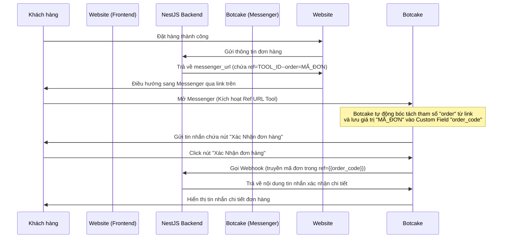

# Hướng Dẫn Cấu Hình Botcake.io Cho Luồng Xác Nhận Đơn Hàng

Tài liệu này hướng dẫn chi tiết cách thiết lập công cụ **Messenger Ref URL** và **Webhook JSON API** trên [Botcake.io](https://botcake.io) để tích hợp với hệ thống NestJS Backend. Dành cho lập trình viên, quản trị viên hệ thống hoặc AI agent tham khảo khi cần chuyển đổi Fanpage hoặc cài đặt mới.

---

## 📌 Sơ Đồ Hoạt Động (Flow)


---

## 🛠️ Hướng Dẫn Cấu Hình Từng Bước Trên Botcake

### Bước 1: Tạo Custom Field Để Lưu Mã Đơn Hàng
Để lưu trữ mã đơn hàng động từ URL chuyển sang, bạn cần tạo một Custom Field lưu thông tin này:
1. Đăng nhập vào **Botcake.io** -> Chọn Fanpage của bạn.
2. Truy cập mục **Cấu hình** (Settings) ở menu bên trái -> Chọn **Custom Field** (Trường tùy chỉnh).
3. Nhấp vào nút **Tạo custom field** (User Field):
   - **Tên trường**: `order_code` (hoặc tên bất kỳ bạn muốn).
   - **Kiểu dữ liệu**: `Text` (Văn bản).
   - Nhấn **Lưu** để hoàn tất.

---

### Bước 2: Thiết Lập Công Cụ Messenger Ref URL
Đây là công cụ sinh liên kết `m.me` để khách hàng click từ website chuyển hướng sang Messenger.
1. Truy cập mục **Công cụ** (Growth Tools) ở menu bên trái -> Nhấp **Tạo mới** -> Chọn **Messenger Ref URL**.
2. Đổi tên công cụ thành tên dễ nhớ (ví dụ: `Link xác nhận đơn hàng`).
3. Chuyển sang tab **2. Thiết lập (Setup)**:
   - Trong bảng **Lưu Payload vào Custom Field** (Query Params):
     - Nhấp **+ Query Params** để thêm một dòng mới.
     - Ô **Key**: Gõ chữ `order` (đây là từ khóa cấu trúc trong URL code backend tạo ra: `ref=TOOL_ID--order=MÃ_ĐƠN`).
     - Ô **Custom Field**: Chọn trường `order_code` vừa tạo ở Bước 1 từ menu thả xuống.
4. ⚠️ **BẮT BUỘC**: Nhấn nút **Lưu (Save)** màu xanh dương ở góc trên bên phải màn hình. Nếu không bấm nút này, cấu hình ánh xạ tham số sẽ không hoạt động.
5. Ghi lại **ID của công cụ** này (nằm ở đuôi của URL chỉnh sửa trên trình duyệt hoặc hiển thị trong link Ref mặc định, ví dụ: `https://botcake.io/.../tools/2567308` thì ID là `2567308`).

---

### Bước 3: Cấu Hình Luồng Tin Nhắn & Gọi Webhook Backend
Thiết lập tin nhắn gửi cho khách khi họ nhấn vào link và gọi API backend để hiển thị thông tin đơn hàng.
1. Quay lại tab **1. Opt-in Message** (hoặc Luồng tin nhắn liên kết với Ref URL).
2. Tạo một Block tin nhắn gửi khách hàng với nội dung chờ:
   - Nội dung mẫu: `Hệ thống đang kiểm tra đơn hàng của bạn, vui lòng chờ giây lát... ⌛`
   - Tạo thêm một Nút bấm (Button) hoặc nút phản hồi nhanh (Quick Reply) có tên: **Xác Nhận đơn hàng**.
3. Khi khách hàng click vào nút **Xác Nhận đơn hàng**, liên kết hành động tiếp theo đến một block **JSON API (Webhook)**:
   - **Phương thức (Method)**: Chọn `POST`.
   - **URL Webhook**: `https://<DOMAIN_CỦA_BẠN>/orders/botcake-webhook`
   - Chuyển sang tab **Params** (Tham số) hoặc **Body** của block Webhook:
     - Thêm tham số: **Key** là `ref`.
     - **Value**: Chọn biến Custom Field `order_code`.
     - ⚠️ **Lưu ý**: Nhấp vào biểu tượng dấu `{}` bên cạnh ô nhập liệu để chọn đúng biến `order_code` (nó sẽ hiển thị dưới dạng bong bóng màu tím hoặc xám đại diện cho biến hệ thống). Không gõ chay dạng chữ `{{order_code}}`.
   - Nhấn **Xong** và **Xuất bản luồng** (Publish).

---

## 💻 Cấu Hình Phía NestJS Backend (Khi Đổi Page Chính)

Khi bạn chuyển giao sang Fanpage chính thức, bạn cần cập nhật các thông tin cấu hình trong dự án NestJS như sau:

### 1. File Môi Trường `.env`
Cập nhật các biến môi trường sau cho phù hợp với Fanpage mới:
```env
# ID của Fanpage Facebook mới
FB_PAGE_ID="ID_TRANG_FACEBOOK_MỚI_CỦA_BẠN"

# Token kết nối của Trang (lấy từ Developer Portal của Facebook hoặc thiết lập cấu hình của Fanpage)
FB_PAGE_ACCESS_TOKEN="token_truy_cap_trang_moi"

# PSID của quản trị viên nhận thông báo đơn hàng mới
FB_ADMIN_PSID="psid_admin_moi"
```

### 2. Cập Nhật Tool ID Trong Backend
Nếu ID của công cụ Messenger Ref URL trên trang mới khác với `2567308`, bạn cần sửa đổi giá trị này trong code backend:

Mở file [order.service.ts](file:///d:/freelancer/YNuQuan/apps/api/src/order/order.service.ts):
1. **Cập nhật hàm tạo URL**:
   Tìm dòng tạo `messengerUrl` (khoảng dòng 78):
   ```typescript
   // Thay '2567308' bằng ID công cụ mới của bạn
   const messengerUrl = `https://m.me/${process.env.FB_PAGE_ID}?ref=NEW_TOOL_ID--order=${orderCode}`
   ```
2. **Cập nhật hàm bóc tách mã đơn (Parser)**:
   Tìm hàm `handleBotcakeWebhook` (khoảng dòng 344) và hàm giải mã webhook FB để thay thế prefix Tool ID tương ứng:
   ```typescript
   if (orderCode.startsWith('NEW_TOOL_ID--')) {
     orderCode = orderCode.replace('NEW_TOOL_ID--', '')
   }
   ```
3. **Cập nhật Unit Test**:
   Mở file [order.service.spec.ts](file:///d:/freelancer/YNuQuan/apps/api/src/order/__tests__/order.service.spec.ts) và thay thế tất cả các giá trị `2567308` cũ bằng `NEW_TOOL_ID` mới để bộ kiểm thử tự động chạy qua bình thường.

---

## 🔍 Hướng Dẫn AI Agent Khác Bảo Trì Gặp Lỗi
Nếu hệ thống phản hồi tin nhắn báo lỗi: `⚠️ Không nhận được tham số ref đơn hàng từ Botcake`:
1. Hãy kiểm tra endpoint debug tại URL: `https://<DOMAIN_CỦA_BẠN>/orders/botcake-debug` để xem chi tiết request body và query gửi từ Botcake.
2. Nếu `ref` gửi sang là rỗng `""`: 
   - Kiểm tra xem khách hàng có click từ một link đơn hàng cũ (sử dụng định dạng cũ `--order--`) không.
   - Kiểm tra xem nút **Lưu** trong tab Thiết lập của công cụ Ref URL đã được click chưa.
   - Kiểm tra xem cấu hình biến Custom Field trong block Webhook JSON API đã chọn đúng biến động từ hệ thống chưa.
